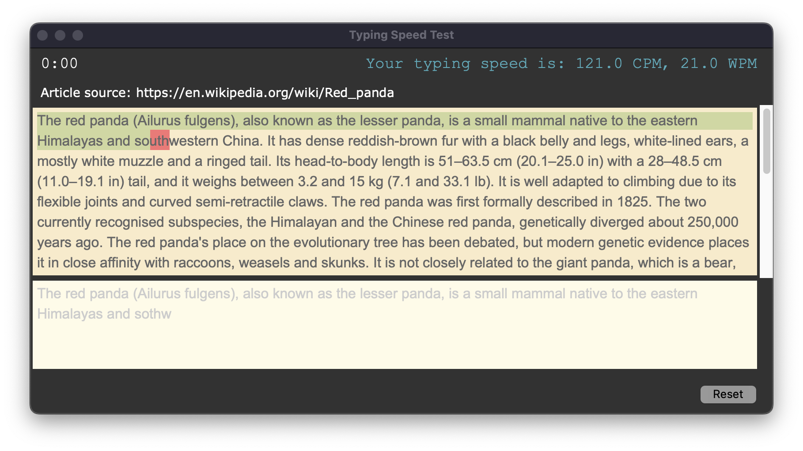
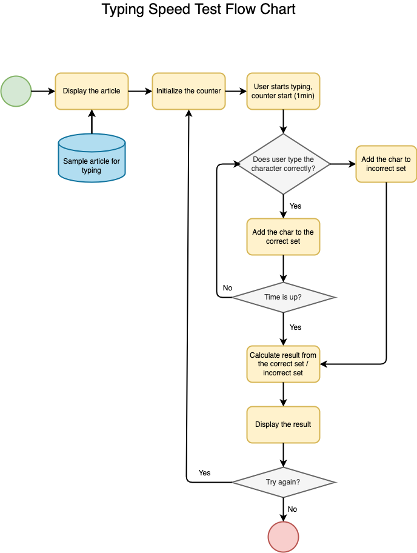

# py04_AppForTypingSpeedTest

Homework for *100 Days of Code: The Complete Python Pro Bootcamp for 2022*

A desktop application which can test user typing speed.

### Reference

* [Red panda - Wikipedia](https://en.wikipedia.org/wiki/Red_panda)
* [TkDocs Tutorial - Text](https://tkdocs.com/tutorial/text.html)
